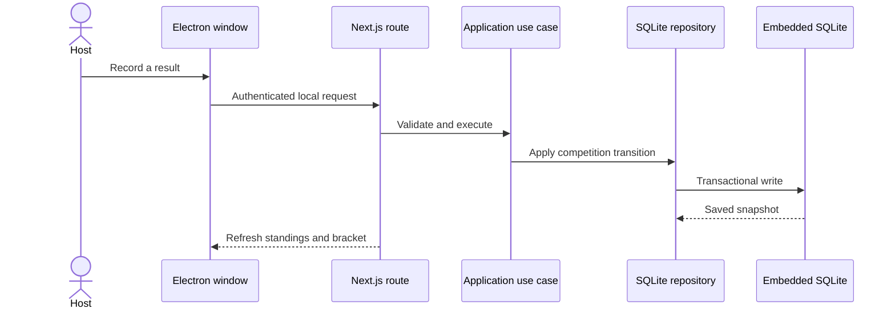

# Architecture Overview

GameHall is a local-first modular monolith for one Windows user. The installer contains an Electron
shell, a production Next.js standalone server, a Node.js runtime, and the native SQLite dependency.
The user does not install or configure any of those pieces separately.

## Desktop runtime

```txt
Electron window
      |
Random authenticated 127.0.0.1 port
      |
Next.js pages and route handlers
      |
Application use cases and ports
      |
Domain rules
      |
Drizzle repositories -> gamehall.db
```

Electron starts the bundled server on an available loopback port, waits for a database-backed health
check, and only then opens the application window. It also owns the announcement and maintenance
schedulers, server-process shutdown, rotating logs, and bounded renderer recovery.

The packaged database and backup directory live under Electron's per-user application-data folder.
Contributor builds use `.gamehall/gamehall.db` unless `GAMEHALL_DB_PATH` is set. Database creation,
schema migrations, and the default local workspace complete before repositories are exposed.

## Boundaries

- `src/app` owns rendering, forms, request parsing, and HTTP responses.
- `src/application` coordinates one user action through narrow repository and gateway ports.
- `src/domain` owns event, table, registration, and competition rules without importing Next.js or Drizzle.
- `src/infrastructure` implements embedded SQLite persistence and the optional Discord webhook adapter.
- `electron` owns desktop process lifecycle and the security boundary around the loopback server.

Route handlers do not query tables directly. Repositories use bounded reads for list views and
transactions for multi-row competition and restore operations.

## Local security and reliability

- The server binds only to `127.0.0.1` on a dynamic port.
- Every packaged-app request requires a random, per-launch desktop session token.
- Mutating requests must also have the expected host, origin, and same-origin browser metadata.
- Scheduled maintenance uses a separate random bearer token.
- The renderer is sandboxed, has Node integration disabled, and cannot navigate away from the app origin.
- SQLite foreign keys, WAL mode, and a busy timeout are enabled.
- Health checks execute a real SQLite query so startup cannot report ready while persistence is broken.
- The shell captures child-process failures and renderer crashes in local rotating logs and attempts a bounded recovery.

There is one trusted user and one internal workspace. Login, teams, roles, tenancy, hosted databases,
and public event pages are intentionally outside the product.

## Request flow


