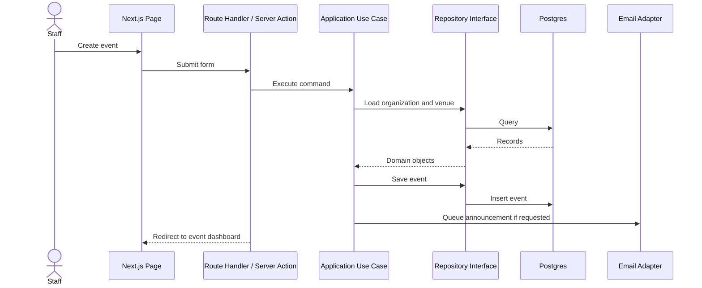

# Architecture Overview

CritTable should be built as a modular monolith first. That gives us clean software boundaries without adding distributed-system overhead before the product needs it.

## High-Level Shape

```txt
Next.js App Router
  app/
    public pages
    staff dashboard pages
    route handlers

Application Layer
  use cases
  authorization checks
  transaction boundaries

Domain Layer
  entities
  value objects
  domain services
  repository interfaces

Infrastructure Layer
  Postgres / Drizzle
  auth provider
  email provider
  Stripe provider
  Discord provider
```

## Principles

- Keep business rules out of React components and route handlers.
- Put use cases behind small application services.
- Depend on interfaces at the domain/application layer, not vendor SDKs.
- Treat Stripe, Discord, email, and auth as adapters.
- Keep the first version a modular monolith; split services only when operational pressure justifies it.
- Make the database schema boring, explicit, and easy to query.

## Request Flow



## First Product Modules

1. **Organizations**: stores, clubs, staff, roles, public profile.
2. **Members**: customer/player profiles scoped to an organization.
3. **Events**: event definitions, sessions, venues, capacity, tags.
4. **Registrations**: RSVP, waitlist, cancellations, check-in.
5. **Payments**: paid entry, refunds, store credit later.
6. **Communications**: announcements, reminders, email, Discord later.
7. **Game Systems**: Magic, Pokemon, Lorcana, D&D, Warhammer, board games.
8. **Leagues**: standings and recurring competitive structures, later.

## Recommended Folder Layout

```txt
src/
  app/
    (marketing)/
    (dashboard)/
    api/
  components/
    ui/
    dashboard/
    events/
    members/
  domain/
    shared/
    organizations/
    members/
    events/
    registrations/
    payments/
    communications/
    game-systems/
    leagues/
  application/
    organizations/
    events/
    registrations/
    payments/
    communications/
  infrastructure/
    db/
    auth/
    email/
    payments/
    discord/
  lib/
```

## Desktop-First UX Architecture

The admin dashboard should be optimized for repeated event operations.

- Left navigation for modules.
- Dense table views with filters and search.
- Detail drawers for quick edits.
- Calendar and list views for events.
- Keyboard-friendly forms.
- Optimistic UI for registration, check-in, and waitlist actions.
- Mobile later for public RSVP and check-in flows.

