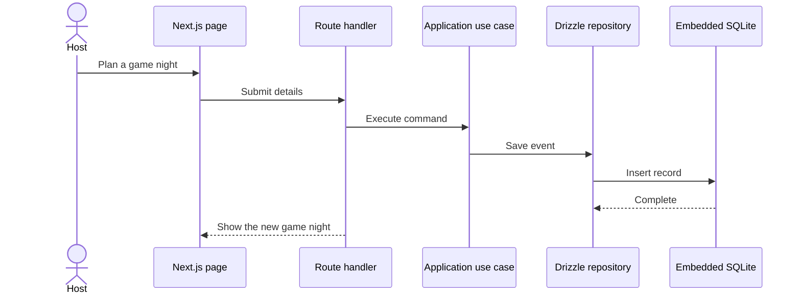

# Architecture Overview

GameHall is a local-first modular monolith for one game-night host. It runs as a Next.js
application and stores all durable data in one embedded SQLite file.

## Runtime shape

```txt
Next.js pages and route handlers
              |
Application use cases and ports
              |
Domain entities and rules
              |
Drizzle repositories
              |
.gamehall/gamehall.db
```

The database directory, schema, and default workspace are created synchronously during application
startup. This guarantees the first request cannot race database initialization.

## Boundaries

- `src/app` owns rendering, forms, request parsing, and HTTP responses.
- `src/application` coordinates use cases through narrow repository and gateway ports.
- `src/domain` owns game-night rules without importing Next.js or Drizzle.
- `src/infrastructure` implements SQLite persistence and optional email or Discord integrations.

## Local data

- The default database is `.gamehall/gamehall.db`.
- `GAMEHALL_DB_PATH` can override the location. The former `CRITTABLE_DB_PATH` name remains supported for upgrades.
- SQLite foreign keys are enabled.
- WAL mode and a busy timeout improve reliability during overlapping requests.
- The database, WAL, and shared-memory files are ignored by Git.

There is one trusted host and one internal workspace. Authentication, sessions, teams, roles, and
tenant selection are intentionally outside the product.

## Request flow


