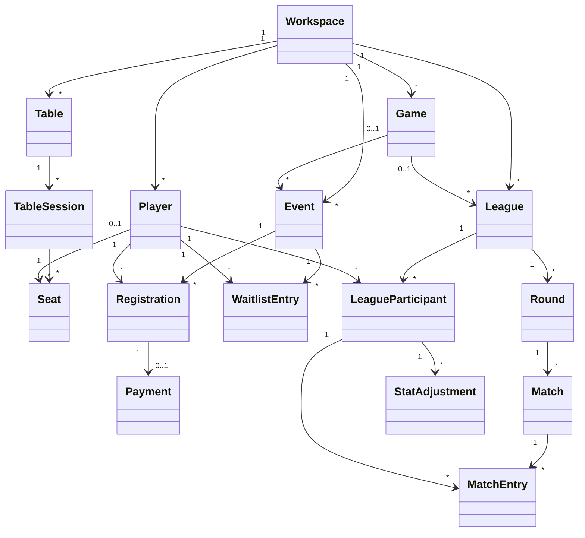

# Domain Model

GameHall models one person's local game-night workspace. Names such as workspace, player, and game
describe the product; the persistence layer retains a few older table names only for upgrade
compatibility.

## Core concepts

- **Workspace**: the internal boundary for one local installation.
- **Player**: someone who can attend an event, sit at a table, or compete in a league.
- **Game**: a reusable TCG, tabletop game, video game, or custom system.
- **Table**, **Table session**, and **Seat**: a physical table, one occupied period, and its player or walk-in guest history.
- **Event**: a scheduled game night with capacity, lifecycle, optional shared cost, and archive state.
- **Registration** and **Waitlist entry**: a player's RSVP/check-in state and ordered overflow queue.
- **Payment**: an optional manual record for a shared cost paid at the event or refunded.
- **Announcement**: an immediate or scheduled event message, optionally sent to Discord.
- **League**: a competition definition, format, configuration, lifecycle, and optional champion.
- **League participant**: an enrolled player with a seed and active/withdrawn state.
- **Round**, **Match**, and **Match entry**: the generated or manual competition schedule and each participant's result.
- **Stat adjustment**: an auditable correction or points award with a reason.
- **Standing**: a projection calculated from completed matches and adjustments, never the source of truth.

## Event and table rules

- A player can have only one active registration for an event.
- Confirmed and pending-payment registrations reserve capacity.
- A full event can place new players on an ordered waitlist when enabled.
- Draft, cancelled, completed, started, or archived events cannot accept new registrations.
- Only confirmed registrations can be checked in.
- Cancelling a registration can promote the next eligible waitlist entry.
- A player can occupy only one active seat at a time.
- Moving a person releases the old seat before opening a seat at the destination.
- Releasing the last occupant closes the table session while retaining its history.
- Past or manually archived events are read-only. The newest 100 are retained; older archive entries
  are permanently removed by maintenance. The UI presents ten archived events per page and supports
  deleting selected entries or the full archive.

## League rules

GameHall supports match play, single and double round robin, Swiss, Swiss with a Top Cut, single and
double elimination, Elo ladder, multiplayer pods/free-for-all, cumulative points, campaigns, and open
play.

- Draft leagues accept enrollment and can start only after the format's minimum player count is met.
- Formats with a fixed schedule stop late enrollment once play starts; flexible formats can keep accepting players.
- Round-robin schedules include every pairing; Swiss rounds pair similar records and avoid rematches where possible.
- Elimination formats generate seeded brackets, automatic byes, winner advancement, lower-bracket recovery, and a reset final when needed.
- Elimination matches require a winner; a draw cannot advance a bracket.
- Pod results record every placement and points value together.
- Ladder results update Elo ratings in chronological order.
- Standings derive wins, losses, draws, byes, points, opponent-win percentage, rating, and competition status from the result history.
- Corrections update or void a match, or add/remove a reasoned stat adjustment, without silently rewriting aggregate totals.
- A league can be completed only when its configured competition state has a valid winner or final ranking.

## Backup rules

- GameHall creates at most one automatic snapshot per UTC day and retains the newest seven.
- Before a restore, it preserves the current database and retains the newest five restore safety copies.
- Before a schema migration, it creates a migration safety copy.
- Uploaded restores are staged, checked as SQLite, integrity-checked, migrated to the current schema,
  foreign-key checked, and then imported transactionally.
