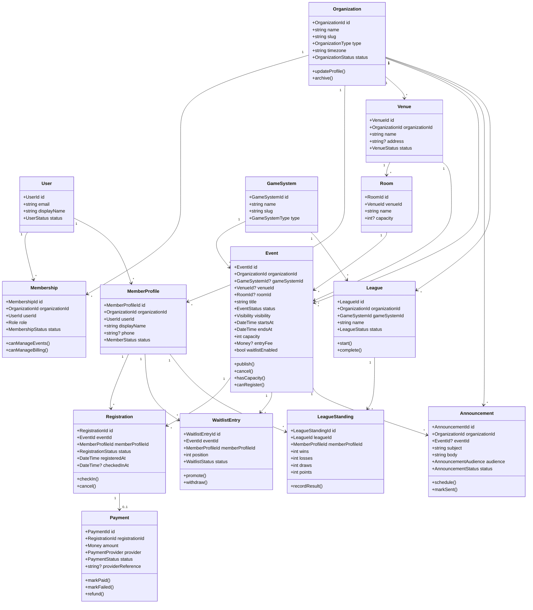

# Domain Model and Class Diagram

This model is intentionally modular. It captures the first business capabilities without locking us into one game type or event format.

## Core Concepts

- **Organization**: a game store, club, convention team, or hobby group.
- **User**: authenticated person using the platform.
- **Membership**: a user's role inside an organization.
- **MemberProfile**: a customer/player identity inside an organization.
- **Venue**: physical place where events happen.
- **Room**: optional subdivision of a venue, such as a play room or table area.
- **GameSystem**: Magic, Pokemon, D&D, Warhammer, board games, etc.
- **Event**: a scheduled activity with capacity, visibility, and registration rules.
- **Registration**: a member's RSVP or paid entry for an event.
- **WaitlistEntry**: a member waiting for a seat.
- **Payment**: record of event-entry payment intent and status.
- **Announcement**: message sent to event attendees or organization members.
- **League**: recurring structure tied to events and standings.

## Class Diagram

## Important Invariants

- Only staff with event permissions can create, publish, cancel, or edit events.
- A member can only have one active registration per event.
- Registrations cannot exceed event capacity.
- If capacity is full and waitlists are enabled, new requests become waitlist entries.
- Paid events must have a successful payment before a registration becomes confirmed.
- Canceled events cannot accept new registrations.
- Organization data must be tenant-scoped in every query.

