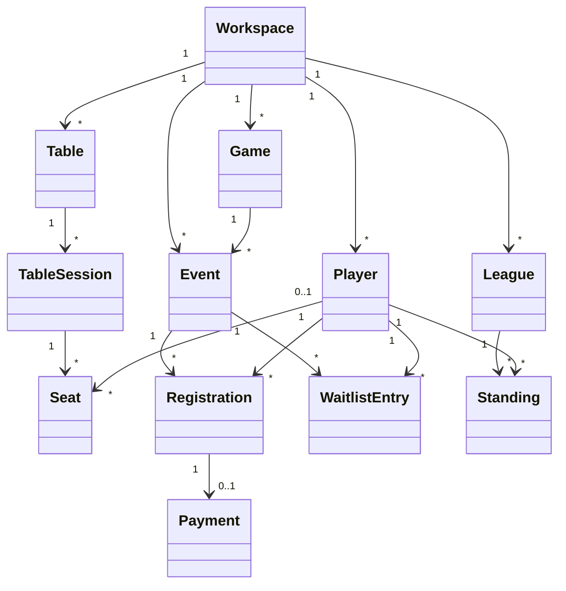

# Domain Model

GameHall models one host's game-night group.

## Core concepts

- **Workspace**: internal boundary for the single local installation.
- **Player**: someone who can attend a game night or appear in league standings.
- **Game**: a reusable game or system with default capacity and notes.
- **Table**: a reusable physical table with a seat capacity.
- **Table session** and **Seat**: one occupied period and its player or walk-in guest history.
- **Event**: a scheduled game night with capacity and visibility.
- **Registration**: a player's RSVP and check-in state.
- **Waitlist entry**: a player waiting for an available seat.
- **Payment**: optional record of an entry fee paid or refunded.
- **Announcement**: optional message for players attending an event.
- **League** and **Standing**: recurring play and player results.

## Important rules

- A player can have only one active registration for an event.
- Confirmed registrations cannot exceed capacity.
- A full event can place new players on a waitlist when enabled.
- Cancelled or completed events cannot accept new registrations.
- Only confirmed registrations can be checked in.
- League results update one standing per player.
- A player can occupy only one active seat at a time.
- Moving a person releases their old seat and opens a seat at the destination.
- Releasing the last occupant closes the table session while retaining its history.

Some internal type names still use `Organization`, `MemberProfile`, and `GameSystem`. Those are
implementation names retained during the product transition; the user-facing language is
workspace, player, and game.
